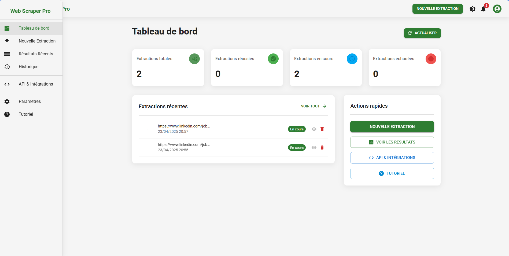

# Web Scraper Application

## Installation

### Installez les dépendances Python :
```bash
pip install -r requirements.txt
```

### Installation du frontend
Accédez au répertoire frontend :
```bash
cd frontend
```

Installez les dépendances :
```bash
npm install
```

## Utilisation

### Démarrer l'application complète
Cette commande démarre à la fois le backend et le frontend.
```bash
npm run start:all
```

### Démarrer le backend uniquement
```bash
python app.py
```

### Démarrer le frontend séparément (mode développement)
```bash
cd frontend
npm start
```

L'application sera accessible à l'adresse http://localhost:3000

## Architecture
Le projet est composé de deux parties principales :

- **Backend** : API FastAPI en Python avec support WebSockets pour les mises à jour en temps réel
- **Frontend** : Application React avec Material-UI pour l'interface utilisateur

## Documentation API
L'API est disponible à l'adresse http://localhost:8000/api. Les principaux endpoints sont :

- `POST /api/scrape` - Démarrer une nouvelle extraction
- `GET /api/tasks/{task_id}` - Récupérer les résultats d'une extraction
- `GET /api/elements` - Analyser les éléments disponibles sur une page

Pour plus de détails, consultez la section API de l'application.

## Exemples d'utilisation
  
### Extraction simple

1. Entrez l'URL du site à extraire
2. Sélectionnez les éléments souhaités (titres, paragraphes, images, etc.)
3. Choisissez le format d'export
4. Lancez l'extraction et visualisez les résultats

### Extraction avancée
- Activez Selenium pour les sites utilisant JavaScript
- Configurez la pagination pour extraire plusieurs pages
- Utilisez l'API pour des extractions automatisées


## Licence
Ce projet est sous licence MIT. Voir le fichier LICENSE pour plus de détails.
