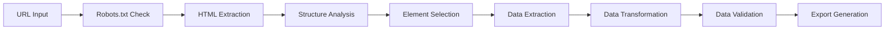

# 🕷️ Advanced Web Scraping Agent Platform

<div align="center">


[](https://python.org)
[](https://javascript.com)
[](https://fastapi.tiangolo.com)
[](https://reactjs.org)

[](https://github.com/YoussefChlih/web_scraping_agent/stargazers)
[](https://github.com/YoussefChlih/web_scraping_agent/network)
[](https://github.com/YoussefChlih/web_scraping_agent/issues)
[](https://github.com/YoussefChlih/web_scraping_agent/blob/main/LICENSE)

[](https://github.com/YoussefChlih/web_scraping_agent/commits)
[](https://github.com/YoussefChlih/web_scraping_agent)
[](https://github.com/YoussefChlih/web_scraping_agent)

**🚀 Intelligent web scraping platform with modern UI and advanced ETL pipeline**

[🔗 Live Demo](http://localhost:3000) • [📖 API Docs](http://localhost:8000/docs) • [🐛 Report Bug](https://github.com/YoussefChlih/web_scraping_agent/issues) • [✨ Request Feature](https://github.com/YoussefChlih/web_scraping_agent/issues)

</div>

---

## 📋 Table of Contents

- [🎯 About The Project](#-about-the-project)
- [✨ Features](#-features)
- [🛠️ Technology Stack](#️-technology-stack)
- [🚀 Quick Start](#-quick-start)
- [📱 Usage](#-usage)
- [🔧 Configuration](#-configuration)
- [📊 ETL Pipeline](#-etl-pipeline)
- [🌐 API Documentation](#-api-documentation)
- [📸 Screenshots](#-screenshots)
- [🤝 Contributing](#-contributing)
- [📄 License](#-license)
- [📞 Contact](#-contact)

---

## 🎯 About The Project

<div align="center">
  
</div>

This **Advanced Web Scraping Agent Platform** is a comprehensive solution for intelligent web data extraction. It combines a powerful Python backend with a modern React frontend to provide an intuitive interface for scraping websites with advanced features like JavaScript support, pagination handling, and real-time progress tracking.

### 🌟 What Makes This Special

- 🎯 **Intelligent Data Detection**: Automatically analyzes page structure and suggests extractable elements
- 🧠 **Advanced ETL Pipeline**: Complete Extract, Transform, Load workflow with data validation
- 📹 **Real-time Updates**: WebSocket integration for live progress tracking
- 🎨 **Modern UI**: React-based interface with Material-UI components
- 🔄 **Multi-format Export**: CSV, JSON, Excel, and Text output formats
- 🤖 **JavaScript Support**: Selenium integration for dynamic content extraction

---

## ✨ Features

### Core Functionality
- ✅ **Intelligent Web Scraping** - Smart extraction with automatic element detection
- ✅ **Multi-URL Support** - Batch processing of multiple websites
- ✅ **Pagination Handling** - Automatic detection and extraction from paginated sites
- ✅ **JavaScript Rendering** - Selenium support for dynamic content
- ✅ **Real-time Progress** - Live updates via WebSocket connections
- ✅ **Multiple Export Formats** - CSV, JSON, Excel, and plain text output

### Advanced Features
- 🔥 **ETL Pipeline** - Complete data transformation and validation workflow
- 📊 **Structure Analysis** - Automatic page structure detection and element suggestion
- 🎨 **Modern Web Interface** - React frontend with Material-UI design
- 🔍 **Robots.txt Compliance** - Automatic robots.txt checking for ethical scraping
- 📱 **Responsive Design** - Works seamlessly across all devices
- 🔐 **Rate Limiting** - Built-in delays and retry mechanisms for respectful scraping

### Data Processing
- 📈 **Data Transformation** - Text cleaning, date normalization, currency conversion
- 🔍 **Data Validation** - Type validation and error handling
- 📊 **Metadata Enrichment** - Automatic addition of extraction metadata
- 🎯 **Preview Generation** - Data preview before final export
- 📋 **Batch Operations** - Process multiple pages simultaneously

---

## 🛠️ Technology Stack

<div align="center">

### Backend Technologies
[](https://python.org)
[](https://fastapi.tiangolo.com)
[](https://uvicorn.org)
[](https://websockets.readthedocs.io)

### Frontend Technologies
[](https://reactjs.org)
[](https://mui.com)
[](https://javascript.com)
[](https://axios-http.com)

### Data Processing
[](https://beautiful-soup-4.readthedocs.io)
[](https://selenium.dev)
[](https://pandas.pydata.org)
[](https://requests.readthedocs.io)

</div>

---

## 🚀 Quick Start

### 📋 Prerequisites

Ensure you have the following installed:

- **Python 3.8+**
  ```bash
  python --version
  ```
- **Node.js 14+** (for frontend)
  ```bash
  node --version
  npm --version
  ```
- **Git**
  ```bash
  git --version
  ```

### ⚙️ Installation

1. **Clone the repository**
   ```bash
   git clone https://github.com/YoussefChlih/web_scraping_agent.git
   cd web_scraping_agent
   ```

2. **Install Python dependencies**
   ```bash
   pip install -r requirements.txt
   ```

3. **Install frontend dependencies**
   ```bash
   cd frontend
   npm install
   cd ..
   ```

4. **Quick start (both backend and frontend)**
   ```bash
   # Start the complete application
   npm run start:all
   ```

   **Or start individually:**

   ```bash
   # Start backend only
   python app.py

   # Start frontend only (in new terminal)
   cd frontend
   npm start
   ```

5. **Access the application**
   - **Frontend**: http://localhost:3000
   - **API Documentation**: http://localhost:8000/docs
   - **API Endpoints**: http://localhost:8000/api

---

## 📱 Usage

### Web Interface (Recommended)

1. **Open the application** at http://localhost:3000
2. **Enter target URL** in the input field
3. **Configure extraction options**:
   - Select output format (CSV, JSON, Excel, Text)
   - Choose elements to extract
   - Enable JavaScript support if needed
   - Configure pagination settings
4. **Start extraction** and monitor real-time progress
5. **Download results** when complete

### Command Line Interface

```bash
# Run the interactive CLI
python web_scraping_agent.py

# Follow the prompts to:
# 1. Enter target URL(s)
# 2. Configure extraction preferences
# 3. Select output format
# 4. Monitor extraction progress
```

### API Usage

```python
import requests

# Start a scraping task
response = requests.post("http://localhost:8000/api/scrape", json={
    "url": "https://example.com",
    "elements": ["titles", "paragraphs", "links"],
    "use_selenium": False,
    "handle_pagination": False,
    "output_format": "JSON"
})

task_id = response.json()["task_id"]

# Check task status
status = requests.get(f"http://localhost:8000/api/tasks/{task_id}")
print(status.json())
```

---

## 🔧 Configuration

### Environment Variables

```bash
# Create .env file
touch .env

# Add configuration
BACKEND_HOST=0.0.0.0
BACKEND_PORT=8000
FRONTEND_PORT=3000
DEFAULT_DELAY=2
MAX_RETRIES=3
SELENIUM_HEADLESS=true
```

### Scraping Configuration

```python
# In web_scraping_agent.py
class WebScrapingAgent:
    def __init__(self):
        self.delay = 2  # Delay between requests (seconds)
        self.max_retries = 3  # Maximum retry attempts
        self.timeout = 30  # Request timeout (seconds)
        
        # User agents for rotation
        self.user_agents = [
            'Mozilla/5.0 (Windows NT 10.0; Win64; x64) AppleWebKit/537.36...',
            'Mozilla/5.0 (Macintosh; Intel Mac OS X 10_15_7) AppleWebKit/605.1.15...',
            # Add more user agents
        ]
```

### Custom Headers

```python
# Custom headers for specific sites
custom_headers = {
    'Accept': 'text/html,application/xhtml+xml,application/xml;q=0.9,*/*;q=0.8',
    'Accept-Language': 'en-US,en;q=0.5',
    'Accept-Encoding': 'gzip, deflate',
    'Connection': 'keep-alive',
}
```

---

## 📊 ETL Pipeline

### Pipeline Architecture



### Extract Phase
- **URL Validation**: Ensures proper URL format
- **Robots.txt Compliance**: Checks scraping permissions
- **Content Retrieval**: Uses requests or Selenium based on requirements
- **Pagination Handling**: Automatically processes multiple pages

### Transform Phase
- **Text Cleaning**: Removes HTML tags and normalizes whitespace
- **Date Normalization**: Converts various date formats to ISO standard
- **Currency Conversion**: Normalizes currency values
- **Data Type Validation**: Ensures correct data types

### Load Phase
- **Multiple Formats**: CSV, JSON, Excel, Plain Text
- **Metadata Addition**: Adds extraction timestamp and source URL
- **File Organization**: Structured output with clear naming

---

## 🌐 API Documentation

### Core Endpoints

| Method | Endpoint | Description |
|--------|----------|-------------|
| `POST` | `/api/scrape` | Start new extraction task |
| `GET` | `/api/tasks/{task_id}` | Get task status and results |
| `GET` | `/api/elements` | Analyze page elements |
| `WebSocket` | `/ws/{task_id}` | Real-time progress updates |

### Request Examples

#### Start Scraping Task

```bash
curl -X POST "http://localhost:8000/api/scrape" \
  -H "Content-Type: application/json" \
  -d '{
    "url": "https://example.com",
    "elements": ["titles", "paragraphs", "links"],
    "use_selenium": false,
    "handle_pagination": false,
    "max_pages": 5,
    "output_format": "JSON"
  }'
```

#### Check Task Status

```bash
curl -X GET "http://localhost:8000/api/tasks/{task_id}"
```

#### JavaScript Example

```javascript
// Start extraction
const response = await fetch('http://localhost:8000/api/scrape', {
  method: 'POST',
  headers: {
    'Content-Type': 'application/json',
  },
  body: JSON.stringify({
    url: 'https://example.com',
    elements: ['titles', 'paragraphs'],
    use_selenium: false,
    output_format: 'JSON'
  })
});

const { task_id } = await response.json();

// Monitor progress via WebSocket
const ws = new WebSocket(`ws://localhost:8000/ws/${task_id}`);
ws.onmessage = (event) => {
  const progress = JSON.parse(event.data);
  console.log(`Progress: ${progress.progress}%`);
};
```

### Response Schema

```json
{
  "task_id": "uuid-string",
  "status": "running|completed|failed",
  "progress": 75,
  "result": {
    "extracted_data": [...],
    "total_items": 150,
    "extraction_time": "2025-07-08T18:40:04Z"
  },
  "output_file": "path/to/exported/file.json",
  "timestamp": "2025-07-08T18:40:04Z"
}
```

---

## 📸 Screenshots

<div align="center">

### 🏠 Main Dashboard


### ⚙️ Configuration Panel


### 📊 Real-time Progress


### 📋 Results View


</div>

---

## 🤝 Contributing

Contributions make the open source community amazing! Any contributions you make are **greatly appreciated**! 🎉

### How to Contribute

1. **Fork the Project**
2. **Create Feature Branch** (`git checkout -b feature/AmazingFeature`)
3. **Commit Changes** (`git commit -m 'Add AmazingFeature'`)
4. **Push to Branch** (`git push origin feature/AmazingFeature`)
5. **Open Pull Request**

### Development Setup

```bash
# Clone your fork
git clone https://github.com/your-username/web_scraping_agent.git

# Create development environment
python -m venv venv
source venv/bin/activate  # Windows: venv\Scripts\activate

# Install development dependencies
pip install -r requirements-dev.txt

# Setup pre-commit hooks
pre-commit install

# Run tests
pytest tests/
```

### Areas for Contribution

- 🎯 **Performance Optimization**: Improve scraping speed and efficiency
- 🎨 **UI/UX Enhancements**: Better user interface and experience
- 📱 **Mobile Support**: Responsive design improvements
- 🧠 **AI Integration**: Smart content detection and classification
- 📊 **Analytics**: Advanced data analysis and visualization
- 🔧 **Configuration**: More customization options
- 📚 **Documentation**: Improve guides and tutorials

---

## 📄 License

Distributed under the MIT License. See `LICENSE` for more information.

```
MIT License

Copyright (c) 2025 Youssef Chlih

Permission is hereby granted, free of charge, to any person obtaining a copy
of this software and associated documentation files (the "Software"), to deal
in the Software without restriction, including without limitation the rights
to use, copy, modify, merge, publish, distribute, sublicense, and/or sell
copies of the Software...
```

---

## 📞 Contact

**Youssef Chlih** - [@YoussefChlih](https://github.com/YoussefChlih)

**Project Link**: [https://github.com/YoussefChlih/web_scraping_agent](https://github.com/YoussefChlih/web_scraping_agent)

### 🌐 Connect with Me

[](https://linkedin.com/in/youssef-chlih)
[](https://twitter.com/youssefchlih)
[](mailto:your.email@example.com)
[](https://youssefchlih.github.io)

---

## 🙏 Acknowledgments

Special thanks to:

- 🚀 **FastAPI** for the modern Python web framework
- ⚛️ **React Team** for the amazing frontend library
- 🎨 **Material-UI** for beautiful components
- 🕷️ **BeautifulSoup** for HTML parsing capabilities
- 🤖 **Selenium** for JavaScript rendering support
- 🐼 **Pandas** for data manipulation tools
- 🌟 **Open Source Community** for inspiration and support

---

## 📈 Project Stats

<div align="center">


### 🔥 Recent Activity

- ✅ Modern React frontend with Material-UI
- ✅ FastAPI backend with WebSocket support
- ✅ Complete ETL pipeline implementation
- ✅ Multi-format export capabilities
- ✅ Real-time progress tracking
- 🔄 Working on AI-powered content detection

### 📊 Language Distribution

```
JavaScript: 64%  ████████████████████████████████
Python:     34.7%  ██████████████████████████
Other:      1.3%   ██
```

</div>

---

<div align="center">

**⭐ Star this repository if you found it helpful! ⭐**

**🔗 Share it with others who might benefit from intelligent web scraping! 🔗**

Made with ❤️ and lots of ☕ by [Youssef Chlih](https://github.com/YoussefChlih)

*Last updated: July 8, 2025*

</div>